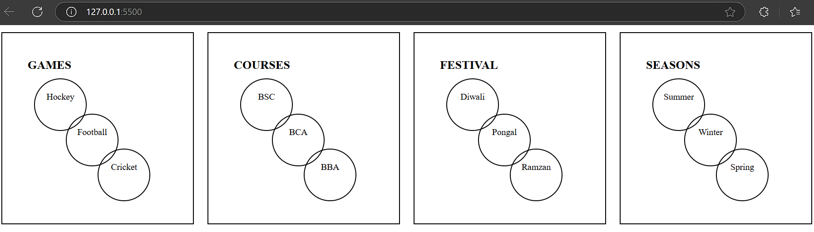

### circles with css

In this i have used the following tags:
div
width
height
border-radius
margin
padding
margin-left
margin-top
text-align
font-size
font-weight
text-transform
align items

### output got

